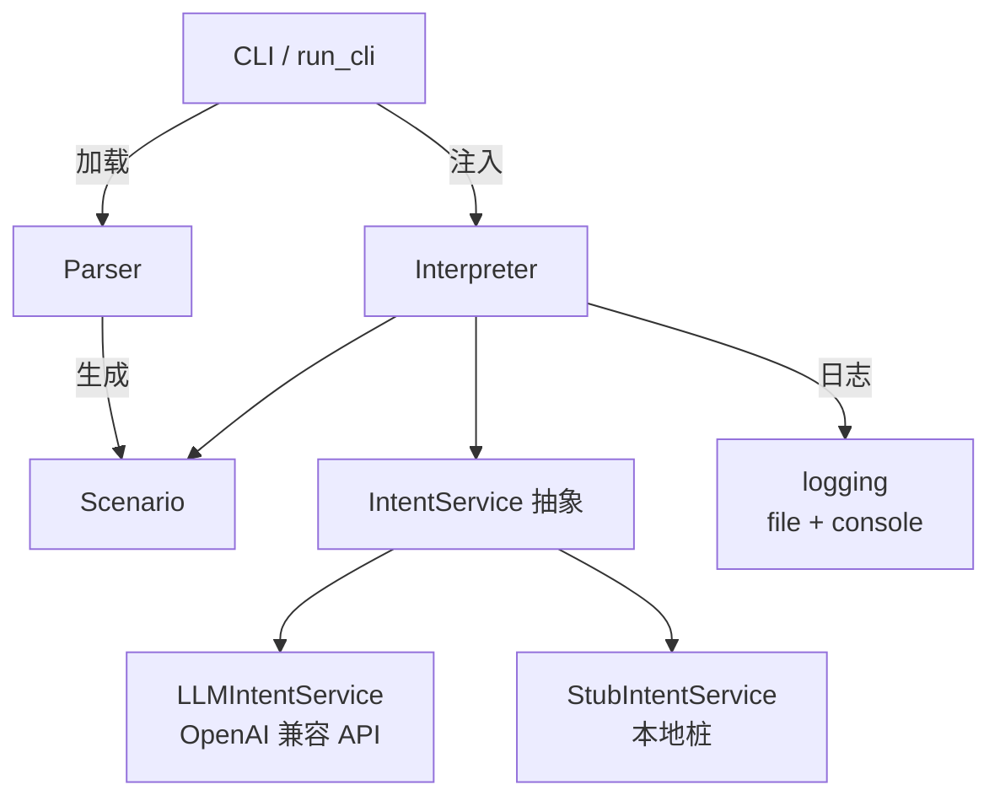

# 设计说明（总体与详细）

本文结合现有代码与文档（`ARCHITECTURE.md`、`DSL_SPEC.md` 等），给出当前实现的总体设计与详细设计，包括子系统划分、类关系、配置/日志/数据文件格式及接口协议。

## 1. 总体设计

### 1.1 子系统划分与关系

- **DSL 解析子系统（parser）**：词法/语法解析 DSL，输出运行时结构并做语义校验。
- **运行时模型子系统（model）**：`Scenario/State/Transition` 数据类，承载对话流程。
- **意图服务子系统（intent_service）**：意图识别抽象，提供 LLM 实现与可离线的桩实现。
- **解释器子系统（interpreter）**：基于运行时模型与意图服务驱动状态迁移，生成回复。
- **CLI/配置与日志子系统（cli）**：入口与交互循环，加载配置/脚本，初始化日志，组装其它子系统。



## 2. 详细设计

### 2.1 DSL 解析子系统的详细设计

- 主要职责：将 `.dsl` 文本解析为 `Scenario`，并校验至少一个状态、每状态唯一 `default`、`goto` 目标存在、标识符小写、初始状态合法。
- 核心类与关系：
  - `Lexer`：按字符流产生 `Token`；识别关键字/标识符/字符串/符号，关键字必须小写，否则抛 `ParseError`。
  - `Parser`：基于 token 流递归下降构建 `State/Transition`，推断或解析 `initial_state`，收集状态列表后做去重与 `goto` 校验。
  - `Token`：携带 `type/value/line/column`，便于错误定位。
  - `ParseError`：包含行列信息的异常。
- 关键逻辑：`_parse_state` 解析一组 `intent` 规则和唯一 `default`；`_parse_next_action` 将 `goto <state>` 映射为目标状态名，将 `end` 映射为 `None`。
- 类关系图：

  ```mermaid
  classDiagram
      class Lexer {
          +tokenize() Iterator~Token~
          -_identifier() Token
          -_string() Token
      }
      class Parser {
          +parse() Scenario
          -_parse_state() State
          -_parse_next_action() str?
          -_validate_gotos(states)
      }
      class Token {+type; +value; +line; +column;}
      class ParseError
      class Scenario
      class State
      class Transition
      Lexer --> Token
      Parser --> Token
      Parser --> Scenario
      Parser --> State
      Parser --> Transition
      ParseError <|-- Lexer
      ParseError <|-- Parser
  ```

### 2.2 运行时模型子系统的详细设计

- 数据类：`Transition(response, next_state)`、`State(name, intents: dict[str, Transition], default: Transition)`、`Scenario(name, states: dict[str, State], initial_state)`。
- 责任：纯数据载体，不含业务逻辑；`Scenario.get_state` 供解释器按名取状态并在缺失时抛出清晰异常。
- 关系：由解析子系统构建，供解释器子系统只读使用。

### 2.3 意图服务子系统的详细设计

- 抽象：`IntentService`（Protocol），约定 `identify(text, state, intents) -> Optional[str]`，要求返回允许列表中的小写意图或 `None`。
- 实现：
  - `StubIntentService`：基于 `mapping: state -> {trigger -> intent}` 的确定性桩，便于测试和离线模式；可选 `default_intent` 兜底。
  - `LLMIntentService`：封装 OpenAI 兼容接口（适配通义千问/百炼），构造包含状态名、允许意图及可选描述的提示词，调用 `client.chat.completions.create` 获得标签；支持重试、超时与最小化 token 返回，无法分类时返回 `None`。
- 类关系图：

  ```mermaid
  classDiagram
      class IntentService {
          <<protocol>>
          +identify(text, state, intents) Optional~str~
      }
      class StubIntentService {
          -mapping: dict
          -default_intent: str?
          +identify(...)
      }
      class LLMIntentService {
          -api_base: str
          -api_key: str
          -model: str
          -intent_descriptions: dict
          -client: OpenAI
          +identify(...)
          -_build_prompt(...)
          -_normalize_result(...)
      }
      class OpenAI
      IntentService <|.. StubIntentService
      IntentService <|.. LLMIntentService
      LLMIntentService --> OpenAI : chat.completions
  ```

### 2.4 解释器子系统的详细设计

- 主要职责：驱动对话状态机，调用意图服务获取标签，选择匹配的 `Transition`，做回复模板替换与状态迁移。
- 状态管理：持有 `_current_state` 与 `_ended`；`reset()` 将状态恢复到初始并清除结束标志。
- 核心流程（`process_input`）：
  1. 若 `_ended` 已为真，抛 `RuntimeError`。
  2. 读取当前 `State`，收集可用意图列表。
  3. 调用意图服务（支持 sync/async），小写化结果；若缺失或不在当前状态意图列表中，走 `default`。
  4. 将 `Transition.response` 中的 `{user_input}` 替换为原始输入。
  5. 若 `next_state is None` 视为 `end` 并置 `_ended=True`；否则更新 `_current_state`。
  6. 记录日志：`state=<before> intent=<matched> next=<after|end> ended=<flag>`。
- 类关系图：

  ```mermaid
  classDiagram
      class Interpreter {
          -scenario: Scenario
          -intent_service: IntentService
          -_current_state: str
          -_ended: bool
          +process_input(user_text) str
          +reset() void
          +current_state: str
          +ended: bool
          -_resolve_intent(text, state, intents) str?
      }
      Interpreter --> Scenario
      Interpreter --> IntentService
      Scenario --> State
      State --> Transition
  ```

### 2.5 CLI / 配置与日志子系统的详细设计

- 入口：`run_cli()`（`main.py` 调用）。
- 主要步骤：
  1. 解析 CLI 参数：`script`、`--config`、`--use-stub/--no-stub`、`--show-intent`、`--api-base`、`--api-key`、`--model`、`--log-file`、`--idle-timeout`。
  2. `_load_config` 读取 INI，支持 `[llm]`/`[settings]`、`[intent_descriptions.<scenario>]`、`[welcome.<scenario>]`。
  3. `_resolve_settings` 按“配置文件 < CLI < 环境变量”优先级合并，布尔/超时时间做类型转换。
  4. 调用 `parse_script` 载入 DSL，构建 `Scenario`。
  5. 初始化日志：默认写入 `logs/<scenario>.log`，文件 handler 级别 INFO，控制台 handler 级别 WARNING，格式 `'%(asctime)s %(levelname)s %(name)s: %(message)s'`。
  6. 根据设置选择 `StubIntentService` 或 `LLMIntentService`，并传入场景专属意图描述。
  7. 启动 REPL：打印欢迎语（可在配置指定），读取用户输入（可选 `select` 超时，超时时传入空串以触发 default），检测 `exit/quit`，调用解释器输出回复；对话结束或用户退出后打印 “Conversation ended.”。
- 流程图：

  ```mermaid
  flowchart TD
      A[启动 CLI] --> B[解析参数+配置]
      B --> C[parse_script 生成 Scenario]
      C --> D[初始化日志/欢迎语]
      D --> E{use_stub? or LLM 配置完整?}
      E -->|是| F[StubIntentService]
      E -->|否| G[LLMIntentService]
      F --> H[Interpreter]
      G --> H
      H --> I[循环读取输入/idle timeout]
      I --> J{exit/ended?}
      J -->|否| I
      J -->|是| K[收尾/退出]
  ```

### 2.6 配置文件说明

- 格式：INI，示例见 `config.example.ini`，真实密钥存于 `.gitignore` 的 `config.ini`。
- 关键段落与字段：
  - `[llm]`: `api_base`（OpenAI 兼容端点）、`api_key`、`model`。
  - `[settings]`: `use_stub`（bool，true 则强制桩）、`show_intent`（bool，日志输出当前状态与结束标记）、`idle_timeout`（秒，<=0 关闭）。
  - `[welcome.<scenario>]`: 自定义欢迎语，键名任意，值为提示文本。
  - `[intent_descriptions.<scenario>]`: 针对该场景的意图描述，键为意图 ID，值为简要说明，随提示传递给 LLM。
- 优先级：环境变量 (`DSL_API_BASE`/`DSL_API_KEY`/`DSL_MODEL`/`DSL_USE_STUB`/`DSL_SHOW_INTENT`/`DSL_IDLE_TIMEOUT`) > CLI 参数 > 配置文件。

### 2.7 日志说明

- 输出位置：默认 `logs/<scenario>.log`，控制台仅警告级别；可通过 `--log-file` 自定义并自动创建目录。
- 格式：`%(asctime)s %(levelname)s %(name)s: %(message)s`（UTF-8），由 `logging.basicConfig` 设置。
- 内容来源：
  - 解释器：`state=<before> intent=<matched|default> next=<state|end> ended=<flag>`。
  - CLI：LLM 配置不完整警告、选择的意图服务、idle 超时触发记录。
- 示例：

  ```log
  2025-11-22 20:09:01 INFO dsl_agent.interpreter: state=start intent=greeting next=routing ended=False
  2025-11-22 20:09:05 INFO root: Idle timeout 5.00s reached, triggering default flow
  ```

### 2.8 数据文件说明

- **DSL 脚本**：位于 `tests/data/*.dsl`，遵循 `DSL_SPEC.md`。示例 `travel_bot.dsl` 展示多状态、多意图与 `{user_input}` 占位符，用作演示与测试输入。
- **黄金转录 JSON**：`tests/data/golden_*.json`，格式：

  ```json
  {
    "scenario": "travel_bot.dsl",          // 关联的 DSL 文件名
    "mapping": { "state": { "trigger": "intent" } }, // 桩意图映射
    "steps": [
      { "user": "hi", "expect_reply": "您好", "expect_state": "routing", "expect_end": false }
    ]
  }
  ```

  测试通过桩 + 预期回复/状态/结束标记做端到端验证。
- **配置模板**：`config.example.ini` 供填写真实密钥与欢迎语。

### 2.9 接口协议说明

- **内部接口**：模块间通过 Python 调用完成，无自定义网络协议；`Parser.parse`/`Interpreter.process_input`/`IntentService.identify` 构成核心接口面向 CLI。
- **外部 LLM 接口**：`LLMIntentService` 使用 OpenAI 兼容 HTTP API（底层 `openai` SDK）`chat.completions.create`，携带系统提示 + 用户提示（包含当前状态、允许意图、用户原文）；承载协议为 HTTPS/JSON。返回内容仅取 `choices[0].message.content`，若不在允许意图列表则回退 `None`。
- **人机交互协议**：CLI 提供文本 REPL，用户输入一行文本，特殊指令 `exit/quit` 结束；支持空闲超时自动发送空串以触发 default 分支。
